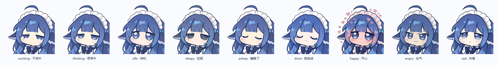

# wb-whale-pet · WorkBuddy 鲸鱼桌宠

一只蓝发鲸鱼娘，浮在桌面右下角，**跟着你的 WorkBuddy 干活状态换表情**。


## 特性

- **状态联动** —— 只读本地数据库，实时跟随 WorkBuddy 的工作状态换表情
- **白底漫画气泡** —— 台词可自定义，语录独立成文件
- **查剩余积分** —— 双击她就能报出余额
- **音效可自选** —— 5 个动作分别配置、支持试听，可换成你自己的音频
- **像插件一样启停** —— 可注册为 MCP 服务，开 WorkBuddy 自动出现，关掉自动退场
- **9 种表情** —— 干活 / 思考 / 待机 / 犯困 / 睡着 / 完成 / 害羞 / 生气 / 失落
- **纯本地** —— 不联网、不写入 WorkBuddy 任何文件

## 表情一览

| 你在干什么 | 她的样子 |
|---|---|
| 有会话在跑且刚还在动 | 半睁眼盯着你 |
| 有会话在跑但 10 分钟没动静 | 眯眼（像是卡住了） |
| 刚跑完一轮 | 眯眼笑 + 音效 |
| 5 分钟内没动静 | 常态待机 |
| 5–15 分钟 | 疲惫脸 |
| 超过 15 分钟 | 闭眼睡着（Zzz…） |



## 安装

需要 **Python 3.9+**（Windows）。

```bash
pip install -r requirements.txt
```

> 国内 pip 慢的话换源：`pip install -r requirements.txt -i https://mirrors.aliyun.com/pypi/simple`

## 启动

双击 **`start.vbs`**（静默启动，不弹黑框）。

| 我想…… | 用这个 |
|---|---|
| 启动 | `start.vbs` |
| 启动并看日志 | `start-debug.bat` |
| 重启（改配置后） | `restart.bat` |
| 关掉她 | `stop.bat`，或右键 → 退出 |
| 开机自启（可选） | `autostart-on.bat` / `autostart-off.bat` |

## 交互

- **拖动** —— 按住左键拖走，松手记住位置
- **单击** —— 害羞一下；**快速连点** —— 会生气
- **双击** —— 报剩余积分
- **右键** —— 菜单：大小 / 置顶 / 锁定位置 / 文字样式 / 音效设置 / 剩余积分
- **托盘图标** —— 菜单与右键相同

## 让她跟着 WorkBuddy 启停

想让「开 WorkBuddy 她就来、关 WorkBuddy 她就走」，把它注册成一个 MCP 服务：

在 `~/.workbuddy/mcp.json` 里加一段（路径换成你自己的）：

```json
{
  "mcpServers": {
    "wb-whale-pet": {
      "command": "python",
      "args": ["<项目目录>/mcp_pet_server.py"]
    }
  }
}
```

⚠️ **两个容易踩的点**：

1. **必须重启 WorkBuddy** —— 这个配置只在应用启动时读一次。
2. **入口在「连接器」页面右上角的「自定义连接器」**，不是那页的搜索框
   （搜索框只搜市场连接器，搜自定义服务永远「未找到」）。

进去找到 `wb-whale-pet` 点「信任」即可。

> 原理：WorkBuddy 启动时会拉起配置里的 MCP 子进程，退出时子进程的 stdin 收到 EOF。
> 宿主启动时拉起桌宠、读到 EOF 时收掉桌宠再退出，生命周期自然绑死。
> 桌宠另有兜底：每 5 秒查一次 WorkBuddy 进程，连续缺席约 20 秒自动退出。

## 剩余积分

双击她即可报出余额。

**WorkBuddy 没有公开的积分 API，本地也不缓存余额**，所以走了点特殊路径：
开一个本地调试端口，通过 CDP 进入它的渲染进程，读运行时对象里的 `usageLeft`。

启用：

1. 双击 **`设置调试端口.bat`**（设环境变量 `WORKBUDDY_REMOTE_DEBUGGING_PORT=9222`）
2. **完全退出并重新打开 WorkBuddy**
3. 双击桌宠

> **为什么不能直接请求接口**：WorkBuddy 界面是本地 `file://` 页面，
> 从那个 origin 请求 `workbuddy.cn` 不会带登录态，必然 401。
> 它自己走 Electron 主进程 IPC，所以读运行时对象才是正解。
>
> **副作用**：会在 `127.0.0.1` 开一个调试端口（外部机器连不上，本机程序可以）。
> 撤销：`reg delete HKCU\Environment /F /V WORKBUDDY_REMOTE_DEBUGGING_PORT`

取不到时可以退回**估算模式**：`pet_config.json` 里把 `points_source` 改为 `"estimate"`
并填 `initial_credit`（套餐总额度），用「总额度 − 本地累计消耗」估算。

自查：`python wb_pet.py --points`

## 台词

全部在 **`quotes.json`**，按情境分类，随便增删，改完重启生效：

```json
{
  "working": ["干活中…", "在写了在写了", "别催，忙着呢"],
  "click":   ["哦鲸鲸！", "哎呀别戳", "嘿嘿…"],
  "points":  ["哦鲸鲸，还剩 {points}", "{points} 积分"]
}
```

`{points}` 会替换成积分数字；缺失的分类自动用内置兜底。

## 音效

双击 **`选音效.bat`**（或右键桌宠 → 音效设置…）打开设置窗口。
5 个动作分别配置，每个都能试听：按下 / 松开 / 双击 / 任务完成 / 查询失败。

**换成自己的音频**：点「打开音效文件夹」，把 **wav / mp3** 丢进去，回来点「重新扫描」，
选好保存、重启桌宠。

> mp3 会自动用 ffmpeg 转 wav。因为播放走 Windows 自带的 `winsound`
> （Qt 的多媒体后端在某些 PySide6 安装里是缺失的），而它只认 wav。

也可直接手改 `pet_config.json` 的 `sound_map`，值填文件名（不带扩展名）。

## 配置

都在 `pet_config.json`（首次运行自动生成，**含个人偏好与凭证，请勿提交**）：

| 键 | 说明 |
|---|---|
| `scale` | 显示尺寸，默认 `0.18`（约 109px） |
| `pos` | 窗口位置，`null` 表示右下角 |
| `always_on_top` / `locked` | 置顶 / 锁定位置 |
| `watch_enabled` | 是否跟随 WorkBuddy 状态 |
| `glow` | 工作态身后那圈淡蓝底光，默认关 |
| `sound_enabled` / `sound_map` | 音效开关与映射 |
| `text_style` | `bubble`（白底漫画气泡）/ `clean`（纯文字描边） |
| `points_source` | `auto` / `cdp` / `estimate` |
| `tie_to_workbuddy` | 是否随 WorkBuddy 退出而退出 |

## 目录结构

```
wb-whale-pet/
├── wb_pet.py            桌宠主程序
├── mcp_pet_server.py    可选的 MCP 宿主（随 WorkBuddy 启停）
├── wb_cdp.py            积分查询（CDP，纯标准库手写 websocket）
├── soundpicker.py       音效设置界面
├── autostart.py         开机自启开关
├── quotes.json          语录库
├── assets/
│   ├── images/          9 张立绘
│   └── audio/           音效（wav 用于播放，mp3 为原始文件）
├── docs/                截图
└── *.bat / *.vbs        双击即用的入口
```

## 调试开关

```bash
python wb_pet.py --probe           # 打印一次状态探测结果
python wb_pet.py --points          # 查一次积分，看用的哪个数据源
python wb_pet.py --click-test      # 验证拖拽不会误移动
python wb_pet.py --snapshot out.png  # 渲染全部表情对照图
python wb_pet.py --selftest out.png  # 启动窗口截图后退出
```

## 已知限制

- **只在 Windows 上测过**。状态检测、自启、音效都依赖 Windows 专有 API。
- **音效同时只能播一个**（`winsound` 的限制），长音频会被下一个打断。
- 没做像素级点击穿透（她默认很小，影响有限）。
- WorkBuddy 内部数据结构可能随版本变化，状态判断与积分读取可能需要跟着更新。

## 致谢

角色立绘与音效来自 [MeteorNOX/DeepSeek-Balance-Whale-Widget](https://github.com/MeteorNOX/DeepSeek-Balance-Whale-Widget)
的 `For–WinDesktop` 分支（MIT License）。本仓库只把它原本的宿主换成了 WorkBuddy，
未改动原始美术资源，版权归原作者所有。

## License

[MIT](LICENSE)
